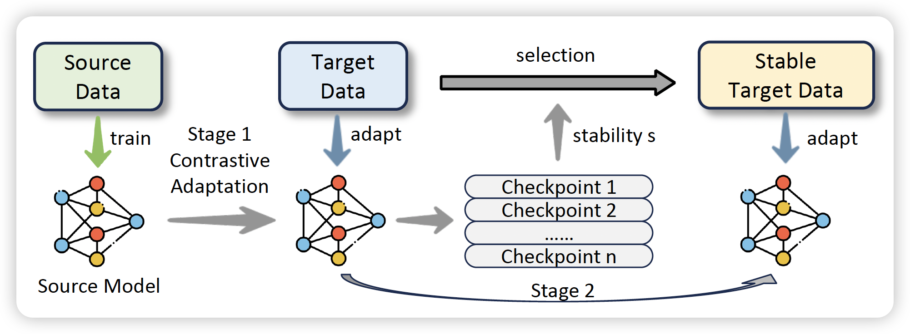

# CASP

[AAAI 2025] Official PyTorch implementation of the paper "Bridging the Gap for Test-Time Multimodal Sentiment Analysis"

## Introduction

Multimodal sentiment analysis (MSA) is an emerging research topic that aims to understand and recognize human sentiment or emotions through multiple modalities. However, in real-world dynamic scenarios, the distribution of target data is always changing and different from the source data used to train the model, which leads to performance degradation. Common adaptation methods usually need source data, which could pose privacy issues or storage overheads. Therefore, test-time adaptation (TTA) methods are introduced to improve the performance of the model at inference time. Existing TTA methods are always based on probabilistic models and unimodal learning, and thus cannot be applied to MSA which is often considered as a multimodal regression task. In this paper, we propose two strategies: **C**ontrastive **A**daptation and **S**table **P**seudo-label generation (CASP) for test-time adaptation for multimodal sentiment analysis. The two strategies deal with the distribution shifts for MSA by enforcing consistency and minimizing empirical risk, respectively. Extensive experiments show that CASP brings significant and consistent improvements to the performance of the model across various distribution shift settings and with different backbones, demonstrating its effectiveness and versatility.




## Getting Started

### Environment

- Python >= 3.8, PyTorch >= 1.8.0

```
git clone https://github.com/zrguo/CASP.git
```

### Datasets

We utilize the extracted data from CMU-MOSEI, CMU-MOSI, and CH-SIMS. The [Toolkit](https://github.com/thuiar/MMSA-FET) is employed for data extraction. While you may opt for different feature extraction methods, please ensure consistency across all datasets to maintain the same dimensionality for model transfer. We will release our extracted datasets in future for convenience.

### Running the Code

#### Step 1: Train the Source model

```bash
mkdir sourcemodel
```

Train the source model on MOSEI:

```bash
python main.py --stage "pretrain" --dataset "mosei" --datapath "mosei-path" --name "sourcemodel/mosei.pt" --num_epochs 30 --backbone "[latefusion/earlyfusion]"
```

Train the source model on MOSI:

```bash
python main.py --stage "pretrain" --dataset "mosi" --datapath "mosi-path" --name "sourcemodel/mosi.pt" --num_epochs 30 --backbone "[latefusion/earlyfusion]"
```

Train the source model on SIMS:

```bash
python main.py --stage "pretrain" --dataset "sims" --datapath "sims-path" --name "sourcemodel/sims.pt" --num_epochs 30 --backbone "[latefusion/earlyfusion]"
```


#### Step 2: Contrastive Adaptation

```bash
mkdir pseudocheckpoint
mkdir stage1
```

```bash
python main.py --stage "contrastive" --pretrained_model "sourcemodel/[mosei/mosi/sims].pt" --datapath "path" --num_epochs 15 --intere 3 --name "stage1/[modelname].pt" --pseudolabel "pseudocheckpoint/[pseudolabel].pt"
```


#### Step 3: Stable Pseudo-label training

First, select high-confident stable labels:

```bash
python pseudolabel.py --pseudolabel "pseudocheckpoint/[pseudolabel].pt" --quantile 0.95 --selected_indice "pseudocheckpoint/[pseudolabel_indice].pt" --selected_label "pseudocheckpoint/[pseudolabel_labels].pt" --name "adaptedmodel.pt"
```

Then, use the stable samples for training:

```bash
python main.py --stage "pseudo" --pretrained_model "stage1/[modelname].pt" --datapath "path" --selected_indice "pseudocheckpoint/[pseudolabel_indice].pt" --selected_label "pseudocheckpoint/[pseudolabel_labels].pt" -num_epochs 5
```

*This is a reconstructed codebase. If you find any errors, please pose an issue or contact the authors.*


## Citation

If you find the repository useful, please cite the following paper:

```bibtex
@inproceedings{guo2024bridging,
  title={Bridging the Gap for Test-Time Multimodal Sentiment Analysis},
  author={Guo, Zirun and Jin, Tao and Xu, Wenlong and Lin, Wang and Wu, Yangyang},
  booktitle={The 39th Annual AAAI Conference on Artificial Intelligence},
  year={2024}
}
```


